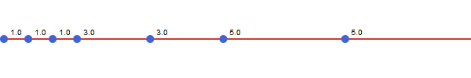
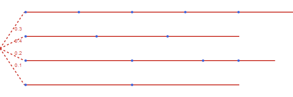
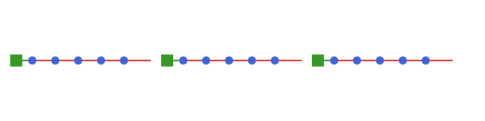
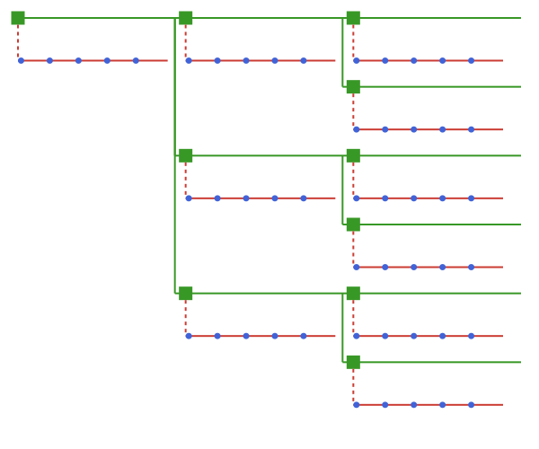

# TimeStruct.jl

Time structures to facilitate modelling with different (multilevel and stochastic) time structures. Note that this package is experimental/proof-of-concept. Expect breaking changes.

The main motivation for the package is to use it in setting up optimization models in e.g. JuMP.

## Overview

The following time structures are available in this package:
- _SimpleTimes_: a simple time structure with one level consisting of multiple periods that can have varying duration

- _OperationalScenarios_: combine multiple time structures with a probability for each time structure

- _TwoLevel_: time structure with two levels - a strategic level and an operational level that is given by a separate time structure

- _TwoLevelTree_: time structure with a tree for the strategic level to support strategic uncertainty


All time structures can be iterated as a sequence of TimePeriods that can be used as indices in an optimization model and for lookups in associated TimeProfiles to get relevant parameter values. 

## Usage

```julia
using TimeStruct
using Unitful
using JuMP

uniform_day = SimpleTimes(24, 1) # 24 hours/day
uniform_year = TwoLevel(365, 24, uniform_day) # 365 days

m = Model() 

# Create variables for all time periods
@variable(m, my_var[uniform_year])


val_per_time = FixedProfile(0.2)

# Create constraints with JuMP something like this:
for t in uniform_year
    @constraint(m, my_var[t] <= val_per_time[t] * duration(t))
end

```

## Stochastic optimization

A simple example illustrating the use of the OperationalScenarios time structure to model a
simple two stage stochastic optimization problem.

```julia

using JuMP
using TimeStruct

periods = OperationalScenarios(5, SimpleTimes(10,1))
scenarios = opscenarios(periods)

model = Model()

I = 1:5
@variable(model, x[I, periods])
@variable(model, y[I], Bin)
@variable(model, npv)
@variable(model, mu[scenarios])

for i ∈ I, t ∈ periods 
    @constraint(model, x[i,t] <= y[i])
end

@constraint(model, sum(y[i] for i in I) <= 2)

for sc ∈ scenarios
    @constraint(model,  mu[sc] == sum(rand() * x[i,t] for i in I for t ∈ periods))
end
@constraint(model, npv == sum(probability(sc) * mu[sc] for sc ∈ scenarios))
```