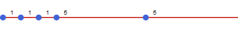
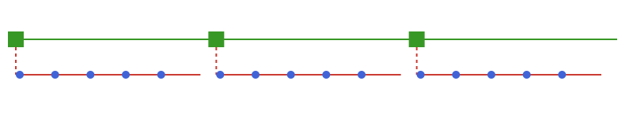
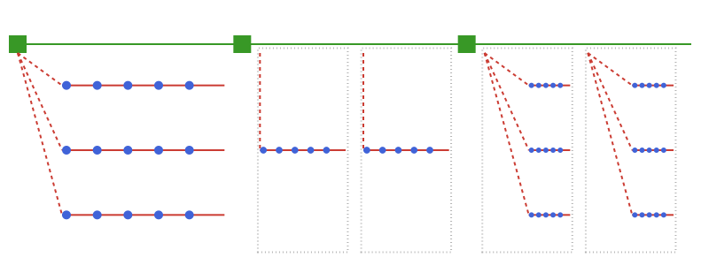

# Summary

[TimeStruct](https://github.com/sintefore/TimeStruct.jl) is a Julia [@bezanson2017julia] package that provides an interface for abstracting time structures, primarily intended for use with the mathematical programming DSL JuMP [@Lubin2023].

TimeStruct allows reuse of much of the code considering tracking of time and allows the main equations to be modelled in a straight-forward manner while supporting a wide range of time structures and easily switching between e.g. simple deterministic operational models and stochastic programming versions of the same model.

The package is already used in several optimization packages developed at [SINTEF], e.g. EnergyModelsX, ZeroKyst and MaritimeNH3. (TODO: links/references)

# Statement of need

For complex optimization models, a significant amount of code is typically used to track the relationships between time periods, further complicated if stochastic versions of the model is developed. Time constraints can be tricky to get correct, and can be a source of subtle bugs, in particular when more complicated structures are involved in models with linking constraints between time periods or scenarios, such as when keeping track of storage inventory over time.

Modellers typically use extra indices to keep track of time and scenarios, making the code harder to read, maintain anf change to support other or multiple time structures. This complexity can be an obstacle during development, testing and debugging, as it is easier to work with simpler time structures.

By abstracting out the time structures and providing a common interface, TimeStruct allows the modeller to concentrate on other properties of the model, keeping the code simpler while supporting a large variety of time structures (pure operational, strategic/investment periods and operational periods, including operational uncertainty and/or strategic uncertainty).

By providing a common interface with time structure semantics simplifies running a single model for different time structures, and may be used to develop decomposition techniques to exploit specific structures.

# Example of use

For a full overview of the functionality of TimeStruct, please see the online [documentation](https://sintefore.github.io/TimeStruct.jl/stable/).

During development and for operational analyses, simple time structures where e.g. time is divided into discrete time periods with (operational) decision variables in time period, can be useful. With TimeStruct, such structures can be easily used in any optimization model. The example in \autoref{fig:simple} shows the basic time structure SimpleTimes which represents a continuous period of time divided into individual time periods of varying duration. The length of each time period is obtained by the `duration(t)` function.

One of the main motivations for the development of TimeStruct is to support multi-horizon time structures [@kaut2014multi]. As a simple example, the time structure `TwoLevel` allows for a two level approach, combining an ordered sequence of strategic periods (typically used for binary capacity expansion) with given duration and an associated operational time structure (for operational decisions using the available capacity in the associated strategic period) as illustrated in \autoref{fig:twolevel}.

Different time structures may be combined to construct more complex structures, consider as an example the combination of a `TwoLevel` time structure with more complex operational structures like `RepresentativePeriods` and `OperationalScenarios`. These may be used alone or in combination, as shown in \autoref{fig:two_complex}.

TODO: pdf versions of figures before submission.

`TimeStruct.jl` also provides data structures for representing parameter data, providing efficient representation and indexing by time period for data with varying level of redundancy. Functionality for computation of disount factors for each time period to facilitate calculation of present values is also included.

# Example applications

TimeStruct is used in multiple optimization models developed at SINTEF. One early application is in [EnergyModelsX](https://github.com/EnergyModelsX/) [@hellemo2024energymodelsx], simplifying the code in `EnergyModelsBase.jl` considerably, and allowing to add capabilities for stochastic programming versions of the model with little extra effort, see e.g. [@bodal2024hydrogen; @kitch2024optimal;@svendsmark2024developing] for examples of applications of EnergyModelsX.

TODO: Add references for these:
- Used in Sirkulær Masseforvaltning
- Used in ZeroKyst

# Acknowledgements

TODO: Project URLs for ZeroKyst and MaritimeNH3

The development of `TimeStruct` was funded by the Research Council of Norway through the projects [ZeroKyst]() ([328721](https://prosjektbanken.forskningsradet.no/project/FORISS/328721)), [MaritimeNH3]() ([328679](https://prosjektbanken.forskningsradet.no/project/FORISS/328679)) and [Clean Export](https://www.sintef.no/en/projects/2020/cleanexport/) ([308811](https://prosjektbanken.forskningsradet.no/project/FORISS/308811))

# References
