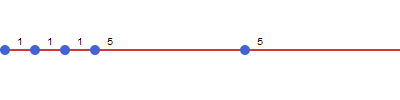

```@setup ts
using TimeStruct
```

# [Operational time structures](@id man-oper)

## [SimpleTimes](@id man-oper-simple)

The basic time structure is [`SimpleTimes`](@ref) which represents a continuous period of time divided into individual time periods of varying duration.
The length of each time period is obtained by the [`duration(t)`](@ref) function.

```@repl ts
periods = SimpleTimes(5, [1, 1, 1, 5, 5]);
durations = [duration(t) for t in periods]
```



## [Calendar based](@id man-oper-calendar)

For some applications it is required to relate the time periods to actual calendar dates.
This is supported by the time structure [`CalendarTimes`](@ref) that alllows for creation and iteration of a calendar based sequence of periods in combination with calendar arithmetic.

The following example shows the creation of a time structure with 12 months starting from
the first of January 2024. The duration of each time period is given in hours by default, but it is possible to specify the time units to use by providing the period type to use:

```@repl ts
using Dates
year = CalendarTimes(DateTime(2024, 1, 1), 12, Month(1));
duration(first(year); dfunc = Dates.Day)
```

You can also make the time structure for a specific time zone as shown in the following
example with 3 days in the end of March with a transition to summer time on the second day:

```@repl ts
using TimeZones
periods = CalendarTimes(DateTime(2023, 3, 25), tz"Europe/Berlin", 3, Day(1));
duration.(periods)
```

## [Operational scenarios](@id man-oper-osc)

Operations often face uncertain operating conditions. In energy systems modeling, a typical example is the availability of wind and solar power.
One method for accounting for this uncertainty is to have multiple operational scenarios that are used to evaluate the cost and feasibility of
operations, where each scenario has a given probability of occurring.

The time structure [`OperationalScenarios`](@ref) represents an unordered collection of
operational scenarios where each scenario has a separate time structure and an associated
probability.

```@repl os
using TimeStruct, JuMP
scenarios = OperationalScenarios(
    3,
    [SimpleTimes(5,1), SimpleTimes(7,2), SimpleTimes(10,1)],
    [0.3, 0.2, 0.5]
);
```


Similar to representative periods, each period has a [`multiple`](@ref) that is defined
relative to the maximum duration for all scenarios. In addition, each time period
has a [`probability`](@ref)equal to the probability of its scenario. Thus we have that:

```@repl os
sum(duration(t) * probability(t) * multiple(t) for t in scenarios)
```

## [Representative periods](@id man-oper-repr)

In some cases, a fine-scale representation for the operations of the infrastructure of the whole time horizon, is not feasible. A possible strategy is then to select one or more representative periods and use them to evaluate operational cost and feasibility. The time structure  [`RepresentativePeriods`](@ref) consists of an ordered sequence of representative periods that represents a longer period of time. Each
representative period covers a specified share of the whole time period.

The following example shows an example with a year with daily resolution represented by two weeks
with a share of 0.7 and 0.3 respectively.

```@repl rp
using JuMP, TimeStruct

periods = RepresentativePeriods(
    2,
    365,
    [0.7, 0.3],
    [SimpleTimes(7,1), SimpleTimes(7,1)]
);
```

The time periods can be iterated both for the whole time structure and individually by each representative period using the [`repr_periods`](@ref) function. This is illustrated here
when setting up a JuMP model with a separate constraint for each representative period:

```@repl rp
m = Model();
@variable(m, prod[periods] >= 0);

for rp in repr_periods(periods)
    @constraint(m, sum(prod[t] for t in rp) <= 10)
end

@constraint(m, sum(prod[t] * multiple(t) for t in periods) <= 1);
```

For each time period the [`multiple`](@ref) function returns how many times the given period
should be counted when aggregating to the whole [`RepresentativePeriods`](@ref) structure. This
will take into account both the duration and share of each representative period, thus
we have that:

```@repl rp
sum(duration(t) * multiple(t) for t in periods)
```
