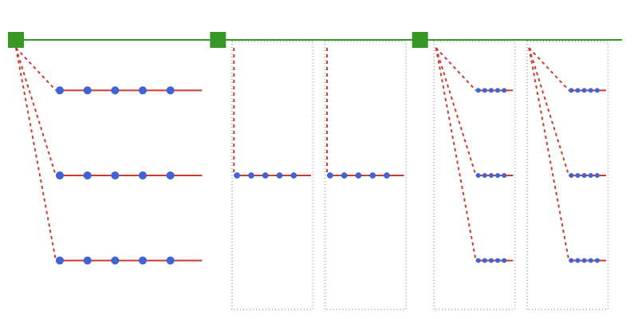

# Multi-horizon time structures

## TwoLevel structure

The main motivation for the `TimeStruct` package is to support
multi-horizon optimization models. The time structure [`TwoLevel`](@ref) allows for a two level
approach, combining an ordered sequence of strategic periods with given duration and an associated operational time structure.

```@repl ts
using TimeStruct
periods = TwoLevel(
    [SimpleTimes(5,1), SimpleTimes(5,1), SimpleTimes(5,1)],
);
```


The following example shows a typical usage of a [`TwoLevel`](@ref) strucure with investment
decisions on a strategic level and operational decision variables. It is possible to iterate
through each strategic period using the [`strat_periods`](@ref)function.

```@repl ts
using JuMP
m = Model();
@variable(m, invest[strat_periods(periods)] >= 0);
@variable(m, prod[periods] >= 0);

for sp in strat_periods(periods)
    @constraint(m, sum(prod[t] for t in sp) <= invest[sp])
end
```

It is also possible to combine a [`TwoLevel`](@ref) time structure with more complex
operational structures like [`RepresentativePeriods`](@ref) and [`OperationalScenarios`](@ref),
alone or in combination, as shown in the following example and illustrated the figure below.

```@repl ts
oper = SimpleTimes(5,1);
scen = OperationalScenarios([oper, oper, oper], [0.4, 0.5, 0.1]);
repr = RepresentativePeriods(2, 5, [0.5, 0.5], [oper, oper]);
repr_scen = RepresentativePeriods(2, 5, [0.5, 0.5], [scen, scen]);

periods = TwoLevel([scen, repr, repr_scen]);
```



In the above examples, the duration of the operational time structures have
been equal to the duration of the strategic periods, but this is not required.
If the duration of the operational time structure is shorter than the strategic
period, this will be accounted for with the [`multiple`](@ref) function.

It is also sometimes convenient to use a different time unit for
the strategic periods than the operational time periods. This is
controlled by the `op_per_strat` field of the [`TwoLevel`](@ref) structure
that holds the number of operational periods per strategic period.

A typical use case is an investment problem where one uses years
to measure duration at the strategic level and hours/days on the operational level.
Below is an example with 3 strategic periods of duration 5, 5, and 10 years
respectively, while the operational time structure is given by
representative periods with duration in days. The `op_per_strat` is then set to 365.

```@repl ts
week = SimpleTimes(7,1);
repr = RepresentativePeriods(2, 365, [0.6, 0.4], [week, week]);
periods = TwoLevel(3, [5, 5, 10], [repr, repr, repr], 365.0);
```

## TwoLevelTree structure

If there is uncertainty at a strategic level, this can be incorporated using the [`TwoLevelTree`](@ref) 
time structure. This structure is represented by a tree, with each node corresponding to a strategic period that contains an operational time structure.
The operational time structure can be any combination of the *[described structures](https://sintefore.github.io/TimeStruct.jl/stable/manual/basic/#Operational-time-structures)*

The following example demonstrates how to create a regular tree  (through the function [`regular_tree`](@ref)) 
where each strategic period spans 3 years and is represented by a week with daily resolution.  
The second  argument to the [`regular_tree`](@ref) function specifies the number 
of branches at each stage of the tree, excluding the first stage.
```@repl ts
using TimeStruct
operational = SimpleTimes(7, 1);
two_level_tree = regular_tree(3, [3,2], operational; op_per_strat = 52);
```


The branching probabilities are equal for all branches as indicated in green in the figure.

!!! note Constructors for `TwoLevelTree`
    Currently, the functionality for creating  `TwoLevelTree`'s is limited. Future versions of the package 
    will expand this functionality to allow creating trees with varying probabilities and different operational 
    time structures for the nodes.


Similar as for [`TwoLevel`](@ref), the strategic nodes can be iterated using [`strat_periods`](@ref). It is possible to connect the nodes to their predecessor by
iterating using the [`withprev`](@ref) iterator that returns a tuple with the parent or nothing if no parent, together with the node itself. This provides
the flexibility to track decisions in the tree as shown by the following example that allows investment into new capacity in each strategic node
while tracking the accumulated capacity.  
```@repl ts
using JuMP

m = Model();
strat_pers = strat_periods(two_level_tree);
@variable(m, invest[strat_pers], Bin);
@variable(m, cap[strat_pers] >= 0);
for (prev, sp) in withprev(strat_pers)
    if !isnothing(prev)
        @constraint(m, cap[sp] == cap[prev] + 10 * invest[prev])
    end
end
```
To ensure consistency across the tree, it is possible to iterate through all strategic scenarios
in the tree using [`strategic_scenarios`](@ref). Here each scenario is a path from the root node
to one of the leaves of the tree. In the example above, if we only allow one investment in the 
planning period, this can be added by restricting the number of investments in each scenario: 
```@repl ts
for sc in strategic_scenarios(two_level_tree)
    @constraint(m, sum(invest[sp] for sp in sc) <= 1)
end
```


