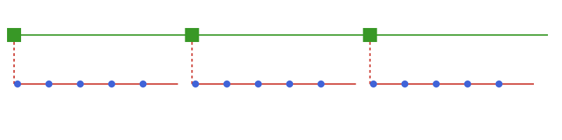

# Multi-horizon time structures

## TwoLevel

The main motivation for the `TimeStruct` package is to support
multi-horizon optimization models. The time structure [`TwoLevel`](@ref) allows for a two level
approach, combining an ordered sequence of strategic periods with given duration and an associated operational time structure.

```@repl ts
using TimeStruct
periods = TwoLevel(
    [SimpleTimes(5,1), SimpleTimes(5,1), SimpleTimes(5,1)],
);
```



The following example shows a typical usage of a [`TwoLevel`](@ref) strucure with investment
decisions on a strategic level and operational decision variables. It is possible to iterate
through each strategic period using the [`strat_periods`](@ref)function.

```@repl ts
using JuMP
m = Model();
@variable(m, invest[strat_periods(periods)] >= 0);
@variable(m, prod[periods] >= 0);

for sp in strat_periods(periods)
    @constraint(m, sum(prod[t] for t in sp) <= invest[sp])
end
```

It is also possible to combine a [`TwoLevel`](@ref) time structure with more complex
operational structures like [`RepresentativePeriods`](@ref) and [`OperationalScenarios`](@ref),
alone or in combination, as shown in the following example and illustrated the figure below.

```@repl ts
oper = SimpleTimes(5,1);
scen = OperationalScenarios([oper, oper, oper], [0.4, 0.5, 0.1]);
repr = RepresentativePeriods(2, 5, [0.5, 0.5], [oper, oper]);
repr_scen = RepresentativePeriods(2, 5, [0.5, 0.5], [scen, scen]);

periods = TwoLevel([scen, repr, repr_scen]);
```


In the above examples, the duration of the operational time structures have
been equal to the duration of the strategic periods, but this is not required.
If the duration of the operational time structure is shorter than the strategic
period, this will be accounted for with the [`multiple`](@ref) function.

It is also sometimes convenient to use a different time unit for
the strategic periods than the operational time periods. This is
controlled by the `op_per_strat` field of the [`TwoLevel`](@ref) structure
that holds the number of operational periods per strategic period.

A typical use case is an investment problem where one uses years
to measure duration at the strategic level and hours/days on the operational level.
Below is an example with 3 strategic periods of duration 5, 5, and 10 years
respectively, while the operational time structure is given by
representative periods with duration in days. The `op_per_strat` is then set to 365.

```@repl ts
week = SimpleTimes(7,1);
repr = RepresentativePeriods(2, 365, [0.6, 0.4], [week, week]);
periods = TwoLevel(3, [5, 5, 10], [repr, repr, repr], 365.0);
```

## TwoLevelTree
