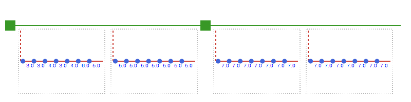

# [Time profiles](@id man-prof)

To provide data for different time structures there is a flexible system of different time
profiles that can be indexed by time periods.

- [`FixedProfile`](@ref): Time profile with the same value for all time periods
- [`OperationalProfile`](@ref): Time profile with values varying with operational time periods
- [`ScenarioProfile`](@ref): Holds a separate time profile for each operational scenario
- [`RepresentativeProfile`](@ref): Holds a separate time profile for each representative period
- [`StrategicProfile`](@ref) : Holds a separate time profile for each strategic period

The following code example shows how these profile types can be combined in a flexible
manner to produce different overall profiles.

```julia
rep_periods = RepresentativePeriods(2, 365, [0.6, 0.4], [SimpleTimes(7,1), SimpleTimes(7,1)])
periods = TwoLevel(2, 365, rep_periods)

cost = StrategicProfile(
            [
                RepresentativeProfile(
                    [
                        OperationalProfile([3, 3, 4, 3, 4, 6, 5]),
                        FixedProfile(5)
                    ]
                ),
                FixedProfile(7)
            ]
        )
```

Illustration of profile values for the various time periods as defined in the profile example

